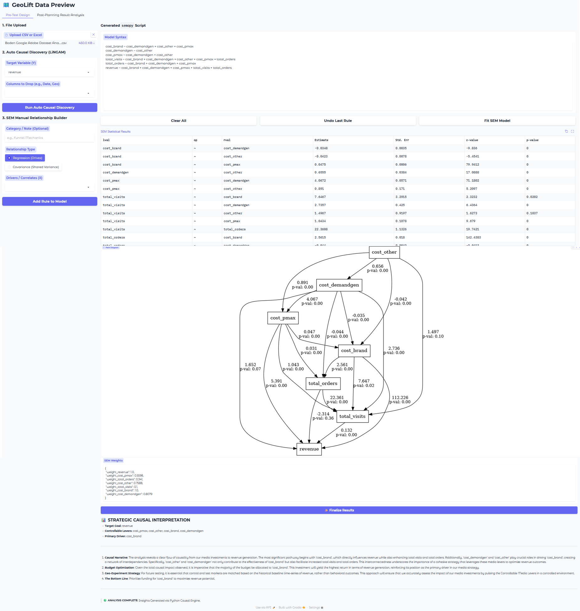
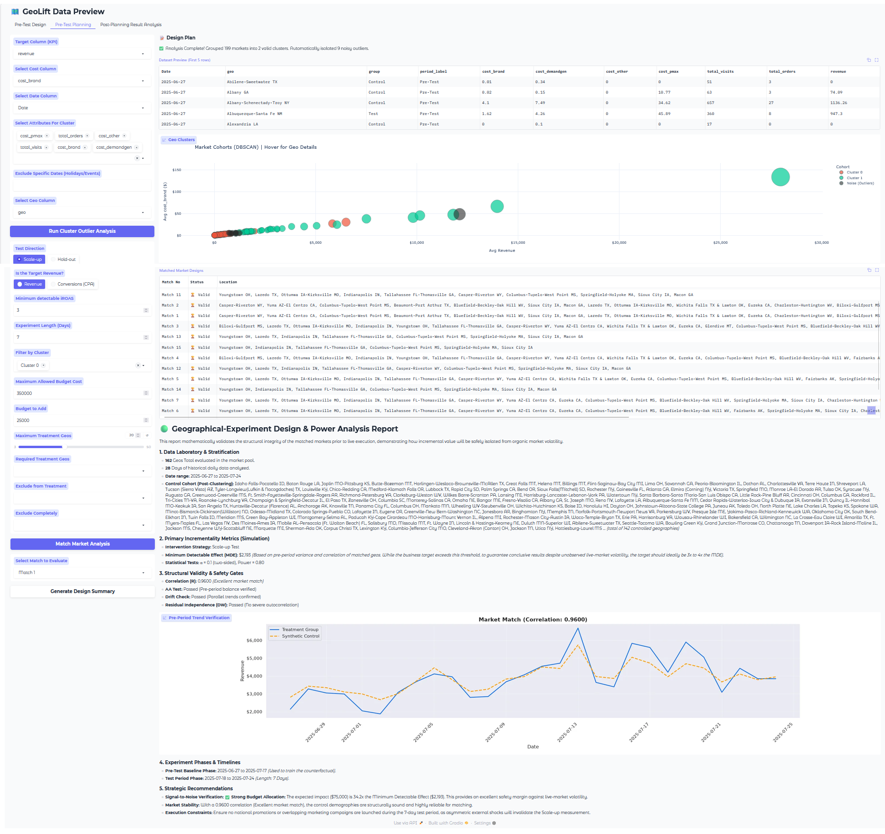

# **Robust Geographical Incrementality Testing**

**An Ensemble Approach Integrating Machine Learning and Structural Equation Modeling**

This repository contains the codebase for a multi-stage causal framework that integrates observational causal discovery with density-based stratification and triangulated causal estimation. By bridging applied computing and strategic execution, this end-to-end ecosystem allows strategic media planners to launch mathematically sound financial experiments without manual interference.

## **Table of Contents**

1. [Project Overview](#bookmark=id.xmnnshm0upf3)  
2. [The Measurement Challenge](#bookmark=id.c1yckk7weig6)  
3. [Methodological Objectives](#bookmark=id.k1w4vr6ij3iy)  
4. [System Architecture & Workflow](#bookmark=id.wcijm8vi86cr)  
5. [Repository Structure](#bookmark=id.xy4wswpm8z9c)  
6. [Input Dataset Schema Requirements](#bookmark=id.mnrxrats51m4)  
7. [Execution Manual (Docker Deployment)](#bookmark=id.dr8nyvfa8dw)  
8. [Significance & Generalizability](#bookmark=id.jnftk2ojryys)

## **Project Overview**

The digital advertising ecosystem has evolved into a complex, multi-channel environment where measuring true incremental return on ad spend (iROAS) is a central challenge. Traditional methodologies struggle to track complicated customer journeys and often confuse coincidence with causality.

To overcome these observational limitations, this project utilizes randomized geo-based experiments. Rather than matching markets blindly on pre-period trends, this framework constrains the matching process using empirically derived causal priors. This prevents structurally dissimilar markets from being paired, effectively eliminating the massive treatment effect heterogeneity bias that inflates variance and hides true ROI.

## **The Measurement Challenge**

Standard industry practice relies on "greedy" matching algorithms that pair test and control regions based primarily on short-term outcome similarity. This approach introduces critical vulnerabilities:

* **Homogeneity Assumption:** Greedy algorithms assume all markets are fundamentally exchangeable, treating structurally distinct regions as if they behave identically.  
* **Myopic Selection:** These algorithms iteratively select the best control for a treated geo and discard remaining controls, artificially reducing the donor pool.  
* **Variance Inflation:** Pairing incompatible units heavily inflates variance and undermines statistical power.  
* **Negative Weighting:** Applying traditional regression models to staggered rollouts under these conditions can mathematically subtract newly treated geos from already-treated geos, creating negative weights.  
* **Blind Execution:** The lack of rigorous pre-experiment simulations leaves marketing teams blind, resulting in tests that are either underpowered or unnecessarily expensive.

## **Methodological Objectives**

The primary objective of this architecture is to develop and validate a replicable causal framework that reduces matching bias and enhances the precision of incremental lift estimation.

### **Key Deliverables**

* **Causal Pathways:** Estimate a panel Structural Equation Model (SEM) with fixed effects to map causal influence and derive a responsiveness score for each market.  
* **Objective Stratification:** Implement a weighted DBSCAN algorithm using correlation distance to objectively cluster Designated Market Areas (DMAs) based on revenue, visits, and responsiveness priors.  
* **De-biased Matching:** Integrate a constrained greedy matching protocol that operates strictly within DBSCAN-derived cohorts to prevent cross-type mismatches.  
* **Statistical Feasibility:** Simulate a synthetic intervention to compute the Minimum Detectable Effect (MDE) against pre-determined thresholds.  
* **Robust Triangulation:** Triangulate causal lift estimation using a 2-out-of-3 voting rule across Time-Based Regression, Quantile Random Forest, and Bayesian Structural Time-Series.

## **System Architecture & Workflow**

The system operationalizes a linear, five-stage methodological workflow transitioning from discovery to actionable execution.

### **Stage 1: Discovery (Causal Priors)**

* The pipeline utilizes semopy to estimate a panel Structural Equation Model.  
* The model uncovers which media channels dynamically drive revenue, assigning an empirical Responsiveness Score to each geographic market.  
* This allows for the visual validation of causal assumptions before financial budgets are committed.

### **Stage 2: Design (Stratified Matching)**

* A Weighted DBSCAN algorithm naturally groups markets into genuine, homogenous cohorts based on structural identity and historical trajectories.  
* The algorithm isolates volatile outliers as noise.  
* Standard Greedy matching is then executed, but strictly constrained within these density-based cohorts to debias the selection at its core.

### **Stage 3: Validation (Safety Gates)**

* Algorithmic gatekeepers force the design through rigorous validation prior to generating an Execution Playbook.  
* The system executes A/A Placebo tests to ensure baseline equivalence.  
* Autocorrelation is scanned via Durbin-Watson diagnostics.  
* Model drift is actively monitored using Brownian Bridge diagnostics.

### **Stage 4: Recommendation & Export**

* Econometric outputs are translated into executive-ready visual waterfalls and cumulative lift charts via a zero-touch Gradio UI.  
* The final ROI is instantly verified, closing the loop from causal hypothesis to financial return.

## **Repository Structure**

The entire pipeline has been transitioned from a notebook environment into a production-ready, containerized application using Docker.

    ├── app.py                       # Core Python application and Gradio UI    
    ├── Dockerfile                   # Container blueprint (Python 3.12 Bookworm)    
    ├── requirements.txt             # Python package dependencies     
    ├── .env                         # Local environment variables (API keys)    
    ├── data/                        # Directory for raw datasets    
    ├── docs/                        # Directory for the paper  
    │   └── screenshots/             # Folder for the images
    └── README.md                    # System instruction manual

## **Input Dataset Schema Requirements**

To evaluate or run the pipeline, ensure your uploaded CSV or Excel file contains the following columnar architecture:

1. **Temporal Identifier:** A date column (e.g., YYYY-MM-DD or DD-MM-YYYY).  
2. **Geographical Unit:** A regional market identifier column (e.g., DMA, city, or region).  
3. **Target Financial KPI:** A continuous numerical variable representing the primary outcome optimization metric (e.g., revenue or conversions).  
4. **Controllable Investment Levers:** One or more continuous numerical columns representing multi-channel media spend levers (e.g., cost\_brand, cost\_pmax, cost\_demandgen).  
5. **Behavioral Mediators (Optional):** Intermediate metric columns tracking customer actions (e.g., total\_visits, total\_orders).

## **Execution Manual (Docker Deployment)**

This application is fully containerized to ensure cross-platform consistency and avoid local dependency conflicts. You must have [Docker](https://www.docker.com/) installed on your machine to run this ecosystem.

### **1\. Environment Configuration**

Create a .env file in the root directory of the repository. Add an OpenAI API key configuration line to enable the automated causal explanations. Ensure this file remains outside version control to maintain anonymity.

Note: The system explicitly expects the environment variable to be named SEM_OpenAI (update this to GLOBAL_OPENAI_KEY if your underlying app.py script uses that name instead).

    SEM_OpenAI=sk-your-actual-api-key-here

### **2\. Build the Docker Image**

Open your terminal, navigate to the project directory, and build the Docker image. This process installs the underlying OS dependencies (Graphviz, Bazel, Git) and Python libraries.

    docker build --no-cache -t my-geolift-app .

### **3\. Launch the Application**

Run the container and map the internal Gradio port to an available port on your host machine (e.g., 14523). The command below also exposes ports for debugging and injects your API key environment configuration.

    docker run -p 14523:7860 -p 5678:5678 -p 8080:8080 --env-file .env my-geolift-app

### **4\. Accessing and Navigating the Interface**

Once the terminal indicates the server is running, open your web browser and navigate to: **http://localhost:14523**

#### **Tab 1: Pre-Test Design (SEM & Discovery)**

* **Step 1:** Upload your historical daily time-series dataset using the file upload box.  
* **Step 2:** Select your target variable (![][image1]) from the drop-down menu, choose variables to drop, and click **"Run Auto Causal Discovery"** to instantly map the underlying directed acyclic graph (DAG) via the DirectLiNGAM algorithm.  
* **Step 3:** Use the manual relationship builder to define structural pathways or directly edit the generated semopy script. Click **"Fit SEM Model"** to view standard errors, path coefficients, and structural path diagrams.  
* **Step 4:** Click **"✨ Finalize Results"** to trigger the background Python causal engine. This translates raw structural parameters into compressed, anchored empirical weights for stratification.

    

#### **Tab 2: Pre-Test Planning**

* **Step 1:** After completing Tab 1, the dataset and derived causal weights will automatically carry over. Click **"Run Cluster Outlier Analysis"** to visualize the weighted DBSCAN scatter plot, dividing your markets into homogeneous cohorts while filtering unmatchable noise.  
* **Step 2:** Select the target clusters to evaluate, define your budget parameters (e.g., target iROAS, experiment length, planned spending changes), and click **"Match Market Analysis"**. The system executes a localized cluster-constrained greedy search using Time-Based Regression.  
* **Step 3:** Review the generated table mapping valid pairs alongside diagnostic safety test statuses (A/A Placebo pass rates, Durbin-Watson auto-correlation ranges, and Brownian Bridge drift checks). Select a match and click **"Generate Design Summary"** to visualize counterfactual tracking alignment and power boundary analysis curves.

#### **Tab 3: Post-Planning Result Analysis**

* **Step 1:** Once your field experiment concludes, upload the compiled actual performance dataset.  
* **Step 2:** Map your target, cost, date, geo, and period indicator columns using the side panel dropdowns. Click **"Generate Pre-Test & Test Result"** to project cross-validation prediction tracking curves.  
* **Step 3:** Review the automated execution report showing absolute incremental costs, true generated revenue lift boundaries at specified confidence intervals, and the triangulation ensemble bar chart evaluating consensus across Frequentist DiD, Machine Learning QRF, and Bayesian STS frameworks.

    

## **Significance & Generalizability**

This study fundamentally advances modern marketing science by bridging correlational Media Mix Modeling with rigorous experimental lift studies. By constraining the greedy matching algorithm within density-based cohorts, the framework formally neutralizes the treatment effect heterogeneity problem.

Furthermore, the integration of a methodological triangulation approach moves the industry away from fragile single-point estimates toward a highly credible, consensus-based causal inference standard. This ensures a verified signal detection capability, drastically reducing the risk of misallocating multi-million dollar budgets due to unobserved market noise.

